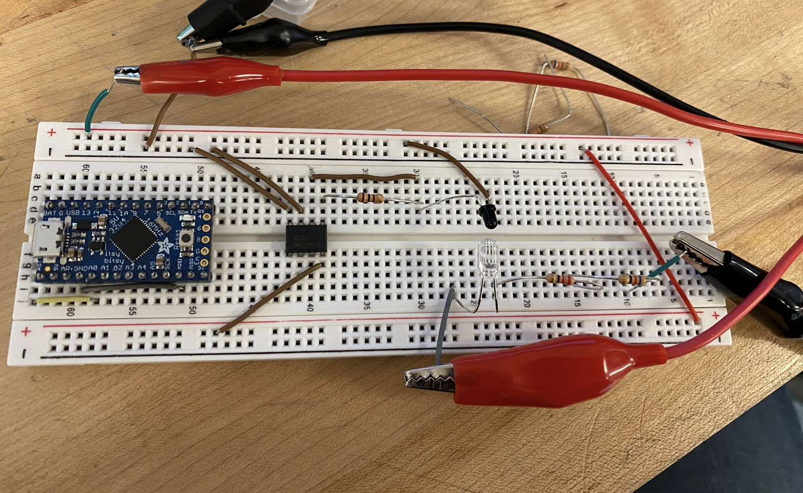
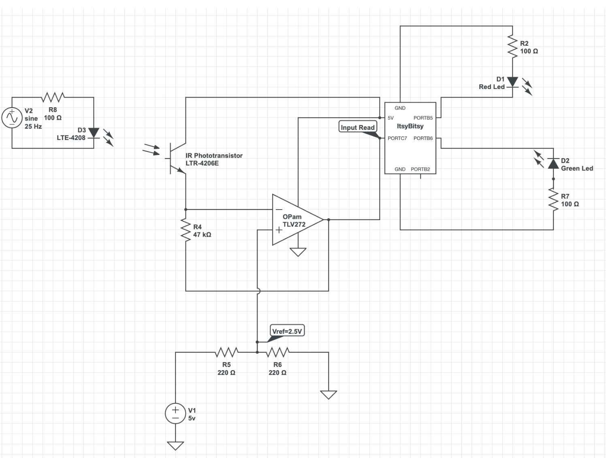

  

    <h1 align="center">Frequency Detection using ATmega32U4</h1>

## Introduction
This project involves creating a detection system to identify specific frequency signals in the presence of ambient noise using an ATmega32U4 microcontroller. The system is designed to detect signals at 25Hz, 200Hz and 662Hz. These frequencies are relevant in various signal processing applications where ambient noise can interfere with signal detection.

  

## Components

1. ATmega32U4 Microcontroller
2. LEDs (Green, Red, Blue)
3. Photoresistor/Phototransistor
4. Opamp or Comparator Circuit (for initial signal conditioning)
5. Oscilloscope (for output visualization)

  

## Implementation
The code configures the microcontroller to measure the frequency of a signal captured by a phototransistor. The Timer/Counter3 of the ATmega32U4 is set up with a prescaler of 1024 to count the intervals between signal edges. Frequency is then calculated based on the time period between two consecutive rising edges of the input signal. The detection is indicated by lighting up different colored LEDs corresponding to the detected frequency range.

  

## Operation

1. The microcontroller reads an input signal from a phototransistor that receives pulses from an LED.
2. The input signal frequency is determined by measuring the time period between its rising edges.
3. The calculated frequency is then compared with predefined frequency ranges to determine the corresponding LED to .light up (Green for 662Hz, Red for 25Hz, Blue for 200Hz).
4. The microcontroller's USB interface is used to output the frequency values for monitoring purposes.

## Result

The system successfully detects the presence of 25Hz, 662Hz, and 200Hz signals within an environment with ambient noise. The detection is visually confirmed through the illumination of specific LEDs and the frequency values are outputted via USB. The system also works at about distance of 2 meters which shows the consistency and usefullnes of circuit.

  

## Challenges and Considerations

Signal conditioning is critical to filter out noise and enhance the detection accuracy. Aligning the transmitting LED and the phototransistor precisely to ensure accurate measurement. The system's ability to differentiate between the target signal and ambient noise such as room lights or sunlight.

#### More details of code struecture and circuit diagram can be found in the project report.
---

##  License

This project is protected under the [MIT] License. For more details, refer to the [LICENSE](https://choosealicense.com/licenses/mit/) file.

---

